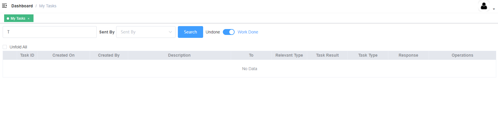

**我的任务/My Tasks**

查询显示当前指派给我的任务

Show tasks currently assigned to me.

**查询条件**

**Query Conditions**

Description Keyword：填写框，关键字描述

Sent By：下拉框，谁发送的

Undone/Work Done：单选框

列表展示所有的任务

Update：弹框显示，点击更改任务类型

Respond：回复内容

Mark As Done：标记为已完成，点击后任务类型状态更新成ActionDone
