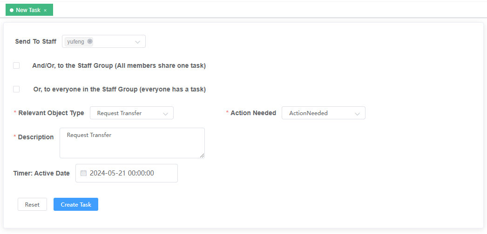

新建任务指派给雇员，进行ERP系统的业务操作

Create a new task and assign it to an employee to perform business operations in the ERP system.

Send To Staff：下拉框，选择发送给谁

And/Or, to the Staff Group (All members share one task)：复选框，雇员组内共享一个任务

Or, to everyone in the Staff Group (everyone has a task)：复选框，每人都有一个相同的任务

Relevant Object Type：下拉框，相关操作类型

Action Needed：下拉框，行动需要

Description：填写框，任务内容描述

Timer: Active Date ：任务激活时间

